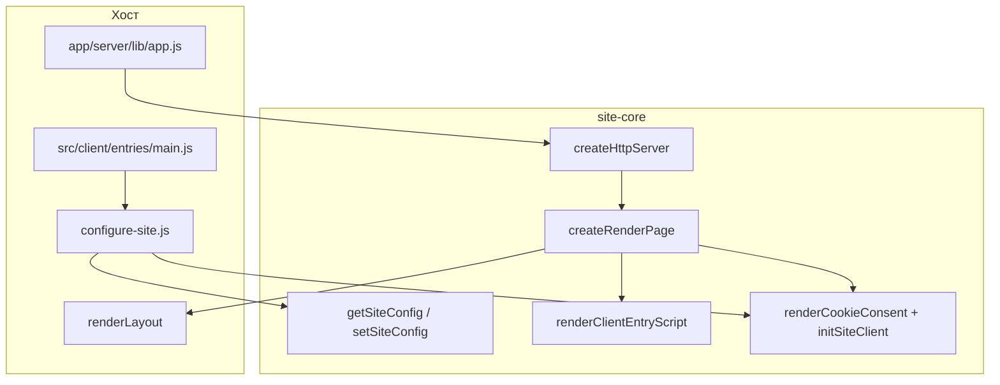

# Архитектура site-core

Обзор для consumer-проектов: как shared-код встраивается в хост.



## Слои пакета

| Каталог | Назначение | Импорт в хосте |
| --- | --- | --- |
| `common/` | утилиты без Node-only deps, SSR-шаблоны | `#core/common/*` |
| `server/` | HTTP, DB, typograf, … | `#core/server/*` |
| `client/` | browser JS (Metrika, forms, …) | `#core/client/*` |
| `types/` | global JSDoc-типы | `node_modules/site-core/types/index.d.ts` в `tsconfig` |
| `test-helpers/` | shared fixture для тестов хоста | `#core/test-helpers/*` |

Код хоста: `app/common/`, `app/server/`, `src/client/` с импортами `#common/*`, `#server/*`, `#client/*`.

## SSR-страница

[`createRenderPage`](../common/templates/page.js) в core собирает `<html>`, `<head>` (title, OG, favicon, fonts, assets) и `<body>`.

Хост передаёт только **`renderLayout`** — разметка **внутри** `<body>` (`.layout`, nav, контент). Core добавляет:

- [`renderCookieConsent`](../common/templates/cookie-consent.js) — cookie-баннер
- ассеты через [`renderPageAssets`](../common/templates/page-assets.js) или кастомный `renderPageAssetsFn` (например inline-бандл)

Инициализация в `app/server/lib/app.js`:

```js
import { createRenderPage } from '#core/common/templates/page.js';

export const renderPage = createRenderPage({ renderLayout });
```

## Client

| Режим | JS entry | CSS |
| --- | --- | --- |
| dev | importmap + `/client/entries/main.js` | PostCSS dev middleware |
| prod | [`renderClientEntryScript`](../common/templates/client-entry-script.js) → `/bundles/main.js` | `<link href="/bundles/main.css">` |

`src/client/entries/main.js` хоста: `import '#common/configure-site.js'` (внутри — `setSiteConfig` + [`initSiteClient`](../client/lib/init-site-client.js)).

## Yandex Metrika и cookie-баннер

Подробная таблица модулей — в [README § Yandex Metrika и cookie-баннер](../README.md#yandex-metrika-и-cookie-баннер).

Кратко: SSR — [`renderCookieConsent`](../common/templates/cookie-consent.js); Metrika — только client-side после согласия; `initSiteClient()` в `configure-site.js`; `yandexMetrikaId` в dev обнуляется в `setSiteConfig`.

## HTTP и роутинг

[`createHttpServer`](../server/lib/http-server.js) + [`createStandardRouteDispatcher`](../server/lib/route-dispatcher.js):

- роуты хоста — объекты с HTTP-методами;
- `{ page }` → `renderPage`; иные ответы — `{ template, statusCode?, contentType? }`;
- path-зеркала — `resolvePathnamePrefix` / `resolveRequest`.

Конфиг: [`getSiteConfig`](../common/lib/site-config.js) / [`setSiteConfig`](../common/lib/site-config.js) — `routes`, `publicPages`, `buildPages`, `yandexMetrikaId`, …

## Статическая генерация

`npm run build` хоста → PostCSS в `public/bundles` + **`site-core-build-static-pages`**:

- страницы из `getSiteConfig().buildPages`;
- `createApp` подгружается из `app/server/lib/app.js` (или `SITE_CORE_APP`).

См. [README § buildStaticPages](../README.md#buildstaticpages).
